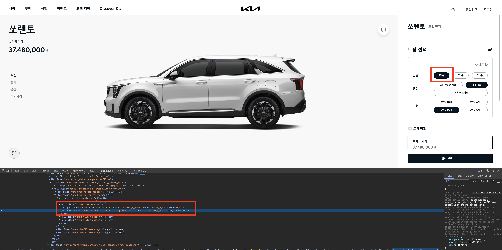
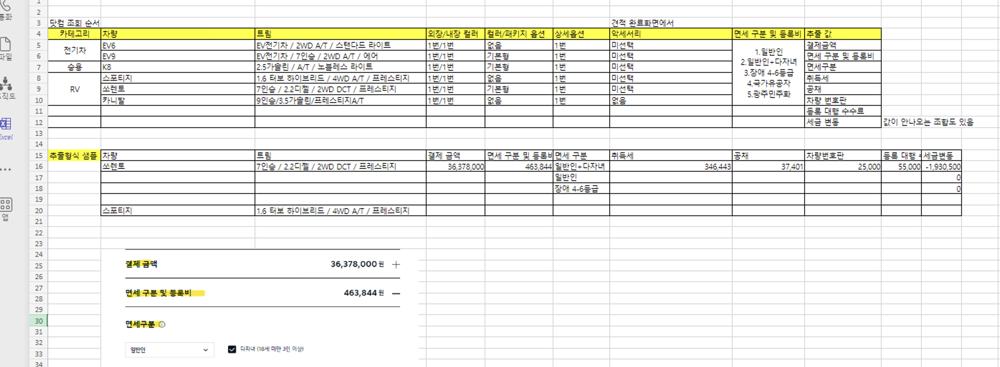
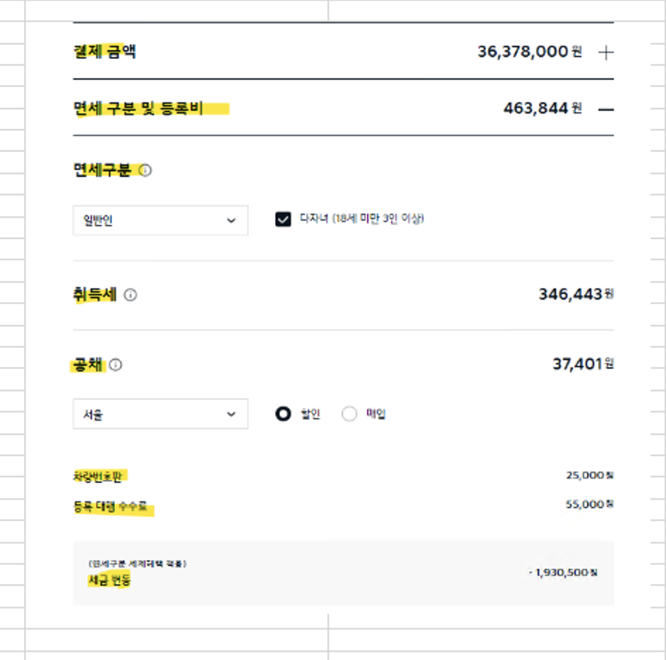
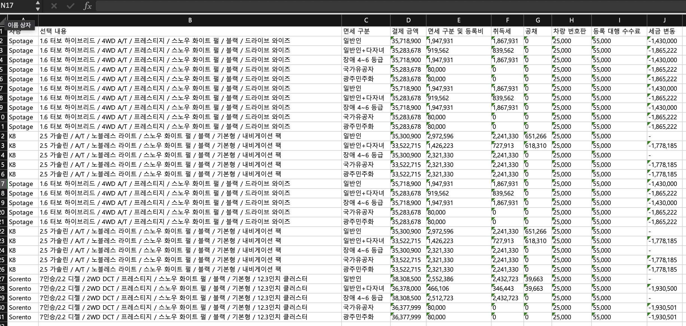

# 1. 기아 차량 가격 크롤러

## 개요
기아 DCS 컨피규레이터와 기아닷컴 사이의 가격 비교를 위해 기아닷컴에서 차량 컨피규레이션에 따른 가격 정보를 엑셀로 저장하는 크롤러(Selenium)

## 사용법
```bash

pip install selenium
pip install webdriver-manager
pip install configparser
pip install openpyxl

python priceCrawling.py ## 해당 파일의 폴더 경로에서 파이썬 코드 실행
```

__`result/` 경로에서 excel 파일로 추출 결과 확인 가능__

___유의사항 : `기아닷컴 웹페이지>차량 견적내기` 접속 후 팝업창의 "오늘 다시보기 하지않기" 클릭 금지___

## 차량 추가 방법

1. `setting.ini`에 차량 필수 정보를 입력
2. `setting.ini`에서 추가한 차량에 대해 `priceCrawling.py`의 코드 추가

### 1. setting.ini에 차량 필수 정보 입력

```ini
[Default]
RESULTPAGE_LOADTIME = 1 
# 기아닷컴의 트림/컬러/옵션/엑세사리 선택이 완료된 최종 견적 페이지에서 각 요소(세금) 선택에 따른 가격 계산 웹페이지 반영 대기 시간

[EV6]
NAME = #차량 이름
NUM = #인승 (해당 요소가 없을 경우 none으로 기재)
URL = # 기아닷컴 차량 견적내기 엔트리 페이지 (ex.https://www.kia.com/kr/buy/build-your-car/build/trim?rcCode=KRCV136)
ENGINE = # 엔진 사양
TRANSMISSION = #미션 사양
TRIM = # 트림
EXT_COLOR = # 외장 컬러
INT_COLOR = # 내장 컬러
PACKAGE = # 컬러/패키지 (해당 요소가 없을 경우 none으로 기재)
OPTION = # 추가 상세 옵션 (추가 옵션 미선택시 none으로 기재)

...

```

차량의 각 정보는 기아닷컴의 태그 element 선택자로 기입해야된다.
setting.ini의 값은 기아닷컴의 label 태그의 for 속성값 기준의 XPATH로 작동됨

아래는 setting.ini Sorento 차량의 데이터 값 샘플


| Key | Value |
|:-----|:-----:|
| NAME | Sorento |
| NUM | filterItem_0_MQ-7 |
| URL | https://www.kia.com/kr/buy/build-your-car/build/trim?rcCode=KRMQ135 |
| ENGINE | filterItem_1_MQ-2 |
| TRANSMISSION | filterItem_2_MQ-D |
| TRIM | trimItem_1033 |
| EXT_COLOR | colorChip_5_0 |
| INT_COLOR | colorChip_7_0 |
| PACKAGE | spec_options_0_A |
| OPTION | detail_option_0_CLT |


아래의 이미지의 붉은 상자처럼 차량의 원하는 옵션의 값을 기아닷컴에서 추출하면 된다.
( 예 : 쏘렌토 차량(인승) -> label 태그의 for 값 : filterItem_0_MQ-7 )



상세 HTML 코드

```html
...

<div class="trim-filter-option">
    <input type="radio" class="btn-check" id="filterItem_0_MQ-7" name="filter_0_05" value="MQ-7">
    <label class="label-radio btn trim-filter-option-label" for="filterItem_0_MQ-7">7인승</label>
</div>

...

```

### 2. 코드 추가

`setting.ini`의 차량 추가가 완료되면 코드에서 해당 차량을 리스트에 추가해야 된다.

```python 
* priceCrawling.py *

...

## Read setting.ini
properties = configparser.ConfigParser()
properties.read('./setting.ini')

default = properties["Default"]

## 기존차량
Spotage = properties["Sportage"]
K8 = properties["K8"]

##-------- 신규 차량(코드 추가 예시) --------
Sorento = properties["Sorento"] # setting.ini에서 추가한 차량(Sorento) 정보 Read

global RESULTPAGE_LOADTIME
RESULTPAGE_LOADTIME = int(default["RESULTPAGE_LOADTIME"])

##-------- 신규 차량(코드 추가 예시) --------
#carList = [Spotage, K8] # 기존 차량 리스트
carList = [Sportage, K8, Sorento] # 기존 리스트에 신규 차량(Sorento) 추가

...

```

## 샘플 양식 & 크롤링 결과

### 결과 추출을 위한 샘플 참고 양식



### 크롤링 결과 EXCEL 파일




# 2. 컨피규레이터와 차량가격 비교